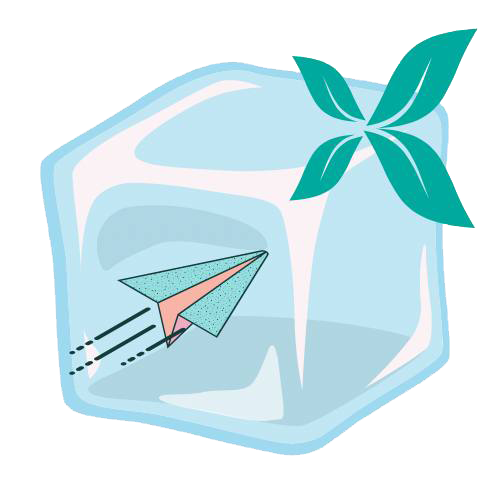
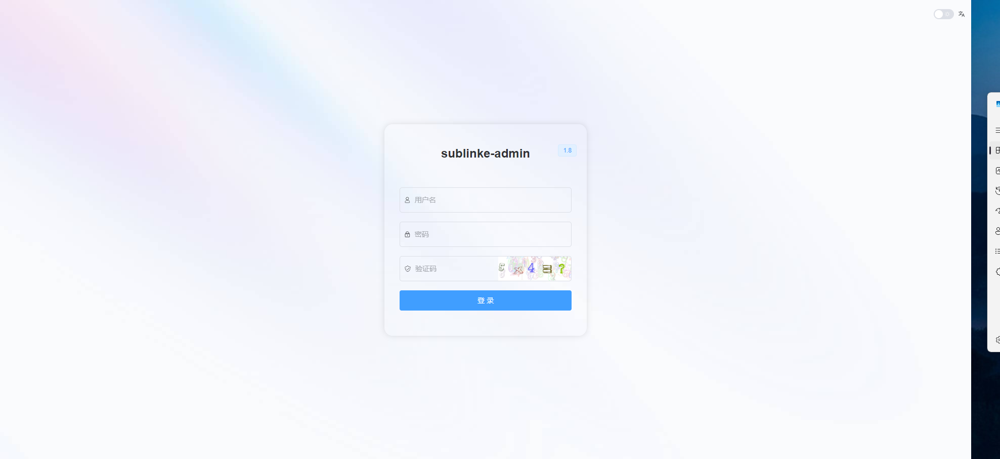
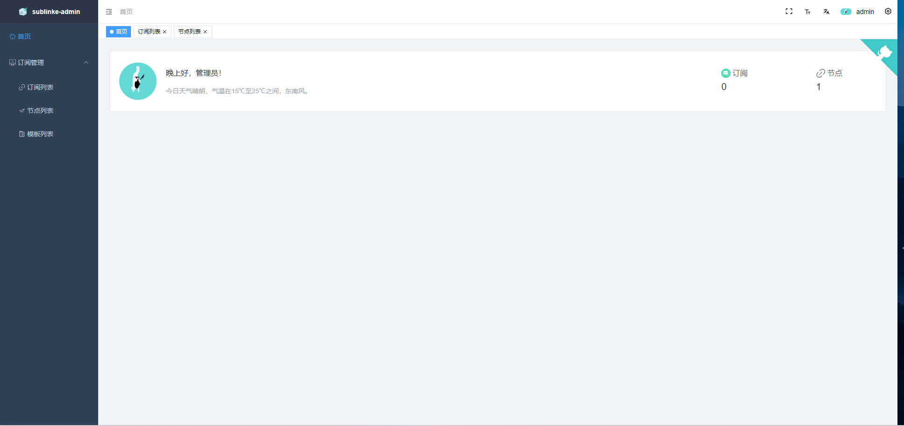
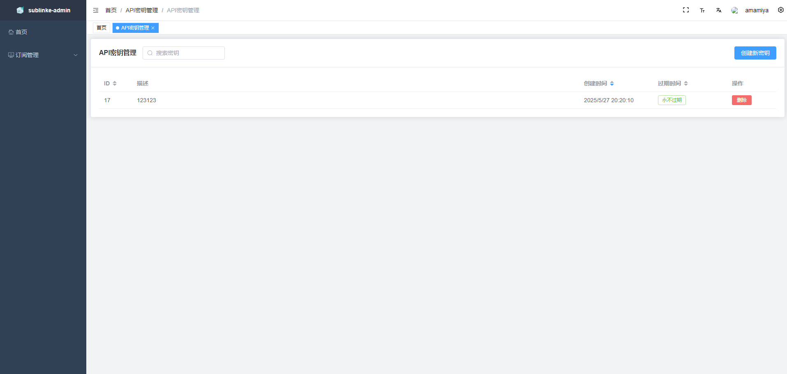
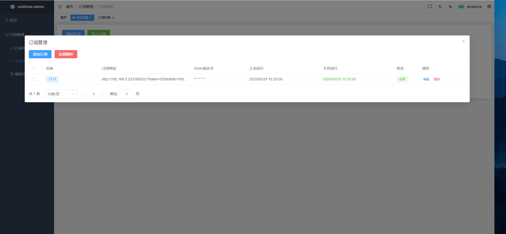
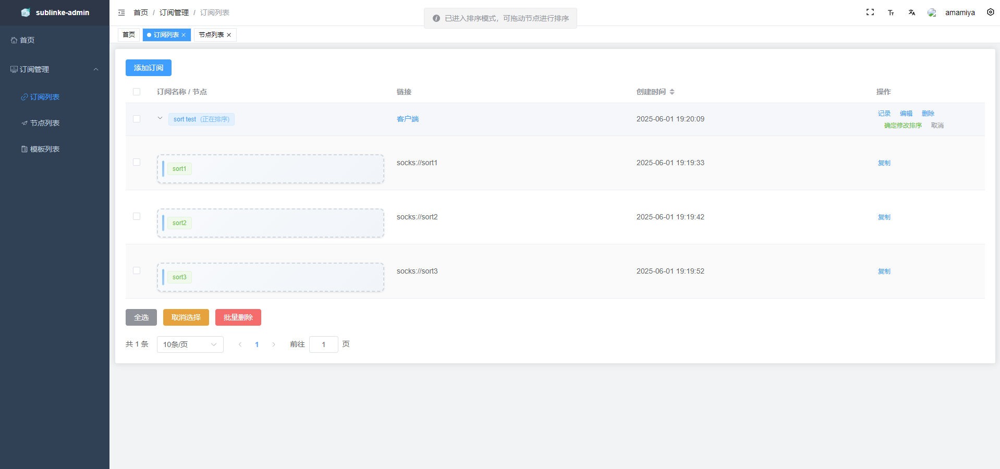
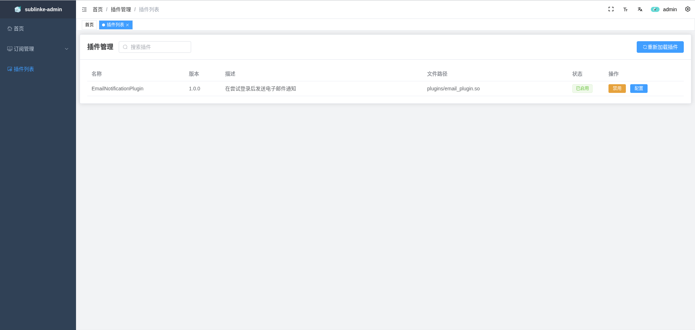

<div align="center">



# SubFlow

🚀 **一站式代理订阅转换与管理平台**

轻松管理你的所有代理节点，一键转换多种客户端格式

[](https://go.dev/)
[](https://vuejs.org/)
[](https://element-plus.org/)
[](LICENSE)
[](https://ghcr.io/sunshinelist/subflow)
[](https://github.com/SunshineList/subflow/releases)

中文 | [English](README.en-US.md)

</div>

---

## ✨ 为什么选择 SubFlow？

<table>
<tr>
<td width="50%">

### 🎨 全新设计的现代 UI
- 基于 Element Plus 深度定制的 SaaS 风格界面
- 毛玻璃登录页、渐变卡片、流畅动画
- 数据可视化仪表盘（协议分布、访问统计、任务状态）
- 深色模式支持，响应式布局

</td>
<td width="50%">

### 🔄 智能订阅管理
- 导入外部订阅链接，自动解析节点
- Cron 表达式定时更新，节点始终最新
- **节点重名自动编号**，彻底告别更新失败
- 拖拽排序，灵活调整节点顺序

</td>
</tr>
<tr>
<td>

### 📡 全协议覆盖
- **V2Ray** — Base64 通用格式
- **Clash** — SS / SSR / Trojan / VMess / VLESS / Hysteria / Hysteria2 / TUIC / AnyTLS / Socks5
- **Surge** — SS / Trojan / VMess / Hysteria2 / TUIC
- Clash `dialer-proxy` 前置代理支持

</td>
<td>

### 🧩 插件扩展系统
- 热插拔插件架构，无需修改核心代码
- Web 界面管理插件启用/禁用和配置
- 提供完整开发示例和编译脚本
- 可监听 API 事件实现自定义逻辑

</td>
</tr>
<tr>
<td>

### 🔐 安全可控
- Token 授权 API 访问
- API Key 独立管理
- 完整的订阅访问记录追踪
- 自托管，数据完全掌控

</td>
<td>

### ⚡ 开箱即用
- Docker 一键部署，多架构支持（amd64 / arm64）
- 一键安装脚本，自动注册系统服务
- SQLite 零配置数据库
- 自动 CI/CD 构建发布

</td>
</tr>
</table>

## 📸 界面预览

| 仪表盘 | 订阅管理 |
|:---:|:---:|
|  |  |

| 节点管理 | 模板编辑 |
|:---:|:---:|
|  |  |

| 插件系统 | 登录页面 |
|:---:|:---:|
|  |  |

## 🚀 快速开始

### Docker Compose 部署（推荐）

```bash
mkdir subflow && cd subflow
wget https://raw.githubusercontent.com/SunshineList/subflow/main/docker-compose.yml
docker compose up -d
```

访问 `http://your-server-ip:8000`，默认账号 `admin`，密码 `123456`

### Docker 运行

```bash
docker run --name subflow -p 8000:8000 \
  -v $PWD/db:/app/db \
  -v $PWD/template:/app/template \
  -v $PWD/logs:/app/logs \
  -v $PWD/plugins:/app/plugins \
  -d ghcr.io/sunshinelist/subflow
```

### 一键安装（Linux）

```bash
wget https://raw.githubusercontent.com/SunshineList/subflow/main/install.sh && sh install.sh
```

> ⚠️ Alpine Linux 由于使用 `musl` 而非 `glibc`，插件模块无法工作，推荐使用 Docker 部署。

## 🧩 插件开发

SubFlow 提供灵活的插件系统，三步即可扩展功能：

```bash
# 1. 参照示例编写插件
cat plugins_examples/email_plugin.go

# 2. 编译插件
wget https://raw.githubusercontent.com/SunshineList/subflow/main/plugins_examples/build_plugin.sh
chmod +x build_plugin.sh && ./build_plugin.sh your_plugin.go

# 3. 部署并在 Web 界面启用
cp your_plugin.so plugins/
```

<details>
<summary>📋 插件接口定义</summary>

```go
type Plugin interface {
    Name() string
    Version() string
    Description() string
    DefaultConfig() map[string]interface{}
    SetConfig(map[string]interface{})
    Init() error
    Close() error
    OnAPIEvent(ctx *gin.Context, event EventType, path string,
               statusCode int, requestBody interface{},
               responseBody interface{}) error
    InterestedAPIs() []string
    InterestedEvents() []EventType
}
```

</details>

## 🏗️ 技术栈

| 层 | 技术 |
|---|------|
| 前端 | Vue 3 + Element Plus + Vite + Pinia + TypeScript |
| 后端 | Go + Gin + Gorm + SQLite |
| 部署 | Docker (多架构) + GitHub Actions CI/CD |
| 包管理 | pnpm (前端) + Go Modules (后端) |

## 🙏 致谢

本项目基于以下优秀开源项目二次开发：

- [eun1e/sublinkE](https://github.com/eun1e/sublinkE) — 原始项目，感谢 eun1e 的辛勤付出
- [sublinkX](https://github.com/gooaclok819/sublinkX) — sublinkE 的上游项目
- [vue3-element-admin](https://github.com/youlaitech/vue3-element-admin) — 前端模板框架

## 📄 License

[MIT License](LICENSE)
